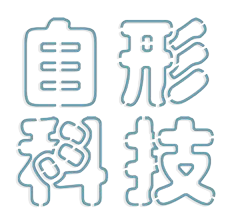

# 自形科技 (Self-Shaping Technology) 🎨

A beautiful React Native text art creation app with extensive Chinese font support, custom background selection, and intuitive design tools.



## ✨ Features

### 🎯 **Core Functionality**
- **Text Art Creation**: Create stunning text-based artwork
- **Real-time Preview**: See changes instantly as you design
- **Multiple Export Options**: Save to gallery and share with others
- **Canvas Ratios**: Support for 1:1, 16:9, 4:3, and 3:4 aspect ratios

### 🎨 **Text Customization**
- **Font Size Control**: Adjustable from 10px to 72px
- **Text Color Selection**: 18 preset colors with visual preview
- **Text Alignment**: 左对齐 (Left), 居中 (Center), 右对齐 (Right), 两端对齐 (Justify)
- **Real-time Editing**: Tap text to edit directly on canvas

### 🖼️ **Background Options**
- **Solid Colors**: 10+ preset solid color backgrounds
- **Gradient Backgrounds**: Beautiful gradient combinations
- **Transparent Background**: For overlay designs
- **Picture Backgrounds**: 45+ curated high-quality backgrounds
- **Gallery Selection**: Choose backgrounds from your photo library

### 📱 **Background Categories**
- **纹理** (Textures): 16 grunge, vintage, and material textures
- **抽象艺术** (Abstract Art): 11 artistic and geometric designs
- **文化主题** (Cultural): 5 traditional Asian patterns
- **自然** (Nature): 3 organic and natural backgrounds
- **现代设计** (Modern): 3 contemporary design elements
- **其他** (Others): 7 miscellaneous backgrounds

## 🎭 **Chinese Font Collection**

### **Built-in Fonts (16 Premium Chinese Fonts)**

#### **Artistic & Handwriting Styles:**
- **汉仪新蒂宝塔体** - Elegant pagoda-inspired font
- **Dymon手写体** - Natural handwriting style
- **新蒂剪纸体** - Traditional paper-cut art style
- **汉仪新蒂春意体** - Spring-inspired brush strokes
- **字魂乌龙茶** - Tea culture artistic font
- **字魂白鸽天行体** - Flying dove elegance
- **美人的字** - Beautiful feminine script
- **阿猪泡泡体** - Cute bubble-style font

#### **Modern & Professional:**
- **DF力王黑体** - Strong, bold sans-serif
- **包图小白体** - Clean, modern design
- **Oz焦糖体** - Sweet, rounded characters
- **源柔大正宋体** - Traditional serif elegance
- **Slidefu字体** - Contemporary typography
- **汉仪白清体** - Minimalist clean style
- **汉仪彩蝶体** - Colorful butterfly design
- **思源黑体** - Adobe's professional font

### **Custom Font Upload** 📁
- **Supported Formats**: TTF, OTF
- **Easy Upload**: Tap "添加自定义字体" to select font files
- **Automatic Loading**: Fonts load instantly and persist between sessions
- **Font Management**: View, use, and delete custom fonts
- **Collapsible Interface**: Custom fonts section can be toggled to save space

## 🖼️ **Gallery Background Selection**

### **New Feature: Custom Backgrounds**
- **From Gallery**: Select images from your photo library
- **Automatic Cropping**: Images are cropped to square format
- **Local Storage**: Custom backgrounds saved locally
- **Background Management**: Add, use, and delete custom backgrounds
- **Persistent Storage**: Backgrounds available across app sessions

### **How to Use Gallery Backgrounds:**
1. Tap **"图片背景"** in the main interface
2. Tap **"从相册选择背景"** button
3. Select an image from your photo library
4. Image is automatically set as current background
5. Custom backgrounds appear in **"我的背景"** section

## 🛠️ **Technical Features**

### **Performance Optimizations**
- **Font Caching**: Custom fonts cached for fast loading
- **Image Optimization**: Background images optimized for performance
- **Memory Management**: Efficient handling of large image files
- **Smooth Scrolling**: Optimized font and background selection

### **User Experience**
- **Haptic Feedback**: Tactile feedback for interactions
- **Loading States**: Clear loading indicators
- **Error Handling**: Graceful error messages
- **Responsive Design**: Works on various screen sizes

## 📱 **Installation**

### **For Users:**
1. **Download APK**: Use the provided download link
2. **Enable Unknown Sources**: Allow installation from unknown sources
3. **Install**: Tap the downloaded APK file
4. **Launch**: Open "自形科技" from your app drawer

### **For Developers:**

```bash
# Clone the repository
git clone [your-repo-url]
cd TextArt

# Install dependencies
npm install

# Install additional Expo packages
npx expo install expo-font expo-image-picker expo-media-library expo-document-picker

# Start the development server
npm start

# Build for Android
npx eas build --platform android --profile preview
```

## 🏗️ **Project Structure**

```
TextArt/
├── assets/
│   ├── fonts/          # 16+ Chinese font files
│   ├── images/         # 45+ background images
│   └── app-icon.png    # App icon
├── components/
│   └── Header.tsx      # App header component
├── App.tsx             # Main application
├── app.json           # Expo configuration
├── eas.json           # EAS build configuration
└── package.json       # Dependencies
```

## 🔧 **Dependencies**

### **Core Dependencies:**
- **React Native**: 0.79.5
- **Expo**: 53.0.22
- **React**: 19.0.0

### **Key Libraries:**
- **expo-font**: Custom font loading
- **expo-image-picker**: Gallery image selection
- **expo-media-library**: Save images to gallery
- **expo-document-picker**: Font file selection
- **react-native-view-shot**: Capture canvas as image
- **expo-sharing**: Share images
- **expo-haptics**: Tactile feedback
- **@react-native-async-storage**: Local data persistence

## 🎨 **Design Philosophy**

### **Chinese-First Design**
- **Native Chinese Interface**: All UI elements in Chinese
- **Cultural Sensitivity**: Respects Chinese design principles
- **Typography Excellence**: Premium Chinese font collection
- **Cultural Backgrounds**: Traditional and modern Asian patterns

### **User-Centric Experience**
- **Intuitive Controls**: Easy-to-understand interface
- **Visual Feedback**: Clear preview of all changes
- **Accessibility**: Large touch targets and clear labels
- **Performance**: Smooth, responsive interactions

## 🚀 **Recent Updates**

### **v2.0 - Major Feature Additions**
- ✅ **Gallery Background Selection**: Choose backgrounds from photo library
- ✅ **Improved Font Management**: Collapsible custom fonts section
- ✅ **Clear Text Alignment**: Chinese labels instead of confusing icons
- ✅ **Enhanced UI**: Better spacing and user experience
- ✅ **App Rebranding**: New name "自形科技" and custom icon

### **v1.0 - Initial Release**
- ✅ **16 Chinese Fonts**: Premium typography collection
- ✅ **45 Background Images**: Curated high-quality backgrounds
- ✅ **Custom Font Upload**: Add your own TTF/OTF fonts
- ✅ **Multiple Export Options**: Save and share functionality

## 📄 **License**

This project is licensed under the MIT License - see the [LICENSE](LICENSE) file for details.

## 🤝 **Contributing**

We welcome contributions! Please feel free to submit a Pull Request.

### **How to Contribute:**
1. Fork the repository
2. Create a feature branch (`git checkout -b feature/AmazingFeature`)
3. Commit your changes (`git commit -m 'Add some AmazingFeature'`)
4. Push to the branch (`git push origin feature/AmazingFeature`)
5. Open a Pull Request

## 📞 **Support**

If you encounter any issues or have questions:

- **GitHub Issues**: Create an issue in this repository
- **Email**: [Your email]
- **Documentation**: Check the code comments for detailed explanations

## 🙏 **Acknowledgments**

- **Font Providers**: All Chinese fonts are properly licensed
- **Background Images**: Curated collection of high-quality textures
- **Expo Team**: For the excellent development platform
- **React Native Community**: For the amazing ecosystem

---

**Made with ❤️ for the Chinese creative community**

*自形科技 - 让文字艺术更简单*
